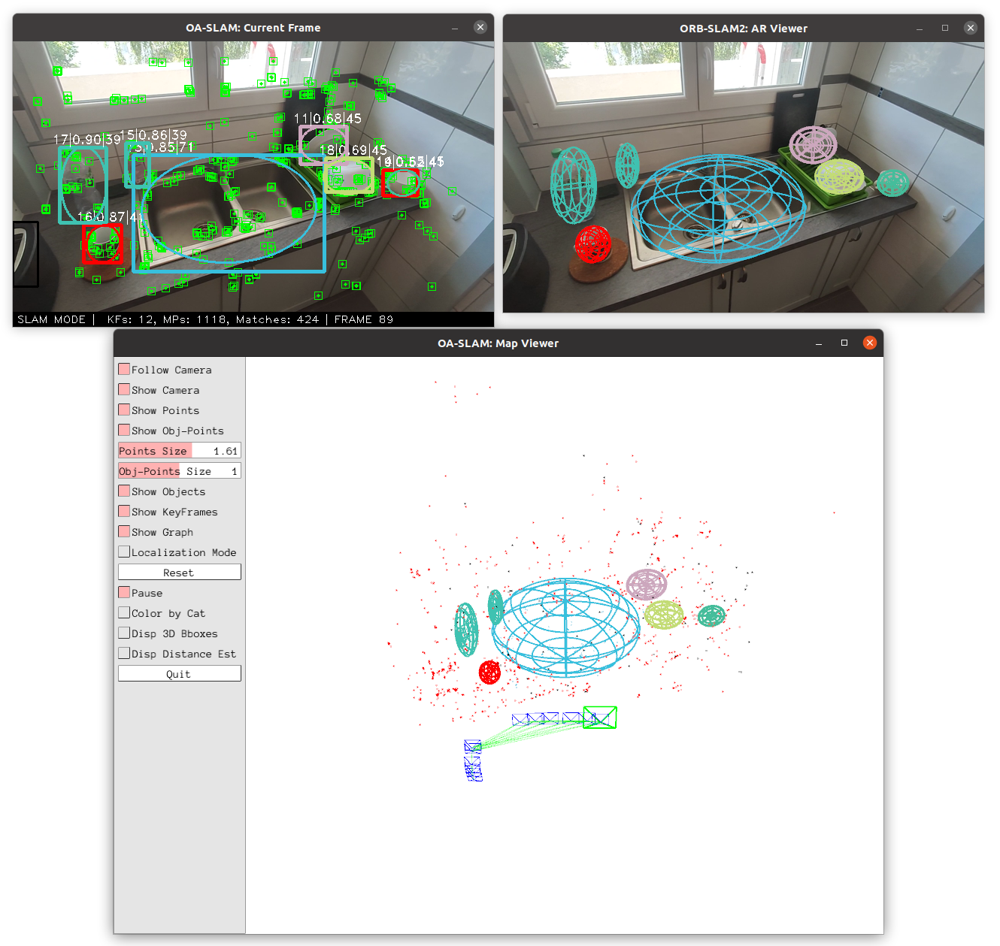
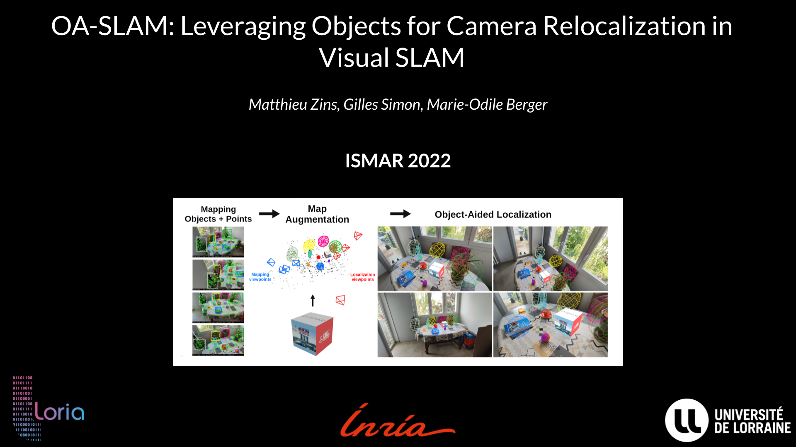

# 说明
- 该工程是从原作者提供的仓库拷贝过来的，非本人创作。因为原地址是用的 “Gitlab at Inria” 平台，不好登录注册，所以想弄到github平台上，方便管理
- 原仓库地址： https://gitlab.inria.fr/tangram/oa-slam
- 原论文地址： https://arxiv.org/pdf/2209.08338.pdf
# ORB-SLAM2

**Associated Publication:**
- **OA-SLAM: Leveraging Objects for Camera Relocalization in Visual SLAM.** Matthieu Zins, Gilles Simon, Marie-Odile Berger, *IEEE International Symposium on Mixed and Augmented Reality (ISMAR 2022).* [Paper](https://arxiv.org/abs/2209.08338)


<p align="center">

</p>

<p align="center">
<a href="https://youtu.be/L1HEL4kLJ3g">  </a>
</p>


# Installation

## Dependencies

- [Pangolin](https://github.com/stevenlovegrove/Pangolin) for visualization and user interface.
- [OpenCV](http://opencv.org) to manipulate images and features.
- [Eigen3](https://gitlab.com/libeigen/eigen) for linear algebra.
- [Dlib](https://github.com/davisking/dlib) for the Hungarian algorithm.
- [Protocol Buffers](https://github.com/protocolbuffers/protobuf) for Osmap.

Included in the *Thirdparty* folder:
- [DBoW2](https://github.com/dorian3d/DBoW2) for place recognition.
- [g2o](https://github.com/RainerKuemmerle/g2o) for graph-based non-linear optimization.
- [JSON](https://github.com/nlohmann/json) for I/O json files.
- [Osmap](https://github.com/AlejandroSilvestri/osmap) for map saving/loading. Modified version to handle objects.

## Building

Clone the repository recursively:
```
git clone https://gitlab.inria.fr/tangram/oa-slam OA-SLAM --recursive
```

Build the Thirdparty libraries:

```
sh build_Thirdparty.sh
```

Generate files for Osmap:
```
sh generate_files_Osmap.sh
```

Build OA-SLAM:
```
sh build.sh
```


# Data


Some test sequences are available in the [TUM-RGB dataset](https://vision.in.tum.de/data/datasets/rgbd-dataset).
In particular, we use the *fr2/desk* scene.

Sample data of our custom scenes are available at: [https://bul.univ-lorraine.fr/index.php/s/R3rkMXMiCHaMwWx](https://bul.univ-lorraine.fr/index.php/s/R3rkMXMiCHaMwWx)


Our system takes object detections as input. We provide detections in JSON files for the sample data and for *fr2/desk* in the *Data* folder. They can be obtained from any object detector.
We used an off-the-shel version of [Yolov5](https://github.com/ultralytics/yolov5) for our custom scene and a fine-tuned version for *fr2/desk*.

The camera parameters for the sample data are available in *Cameras/MI9T_640x360_0.6.yaml*.
The parameters for *fr2/desk* are in *Cameras/TUM2.yaml*.

# SLAM mode

OA-SLAM includes a map viewer, an image viewer and a AR viewer.

Usage:
```
 ./oa-slam
      vocabulary_file
      camera_file
      path_to_image_sequence (.txt file listing the images or a folder with rgb.txt)
      detections_file
      relocalization_mode ('points', 'objects' or 'points+objects')
      output_name 
      show_AR_viewer (0 or 1)
```


Example to run OA-SLAM on the scene *Table*:

```
./oa-slam ../Vocabulary/ORBvoc.txt ../Cameras/MI9T_640x360_0.6.yaml ../Data/sink_21/frames/ ../Data/detections_yolov5_sink_21.json points+objects sink 1
```


Example to run OA-SLAM on the scene *Sink*:

```
./oa-slam ../Vocabulary/ORBvoc.txt ../Cameras/MI9T_640x360_0.6.yaml ../Data/sink_21/frames/ ../Data/detections_yolov5_sink_21.json points+objects sink 1
```


Example to run OA-SLAM on the scene *fr2/desk*:
```
./oa-slam ../Vocabulary/ORBvoc.txt ../Cameras/TUM2.yaml ../Data/rgbd_dataset_freiburg2_desk/rgb.txt ../Data/detections_yolov5_tum_rgbd_fr2_desk.json points+objects fr2 1
```


# Localization mode


This mode can be used when you have a good map of your working area. In this mode the Point and Object Mapping is deactivated. The system localizes and track the camera in the map, using relocalization if needed.
It is possible to force relocalization on each frame by setting 'force_relocalization_on_each_frame' to 1.

Usage:
```
 ./oa-slam_localization
      vocabulary_file
      camera_file
      path_to_image_sequence (.txt file listing the images or a folder with rgb.txt)
      detections_file
      map_file (.yaml)
      relocalization_mode ('points', 'objects' or 'points+objects')
      output_name 
      show_AR_viewer (0 or 1)
      force_relocalization_on_each_frame (0 or 1)
```


Example to run OA-SLAM in **Localization** mode on an existing map of the scene *Table* (pre-built from the image sequence *table_6*):

```
./oa-slam_localization ../Vocabulary/ORBvoc.txt ../Cameras/MI9T_640x360_0.6.yaml ../Data/table_9/frames/  ../Data/detections_yolov5_table_9.json ../Data/table_6_map/map_table.yaml points+objects table_reloc 1 0
```

Example to run OA-SLAM in **Localization** mode on an existing map of the scene *Sink* (pre-built from the image sequence *sink_13*):
```
./oa-slam_localization ../Vocabulary/ORBvoc.txt ../Cameras/MI9T_640x360_0.6.yaml ../Data/sink_18/frames/  ../Data/detections_yolov5_sink_18.json ../Data/sink_13_map/map_sink.yaml points+objects sink_reloc 1 0
```
For both examples, you can check that relocalization fails when only points are used.


# License

OA-SLAM is released under a GPLv3 license. The code is based on [ORB-SLAM2](https://github.com/raulmur/ORB_SLAM2).


